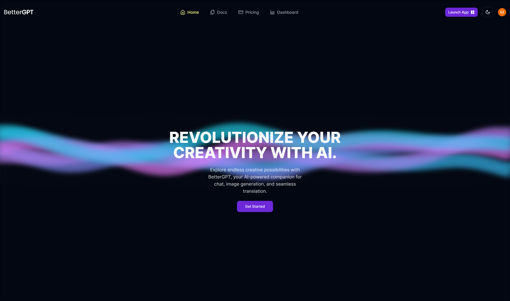

# [BetterGPT](https://github.com/TheArcus02/Better-GPT)

This is an open source AI based build in Next.js 13.

[](https://better-gpt-demo.vercel.app)


## Tech Stack

- **Framework:** [Next.js](https://nextjs.org)
- **Styling:** [Tailwind CSS](https://tailwindcss.com)
- **User Management:** [Clerk](https://clerk.com)
- **Form validation:** [Zod](https://www.npmjs.com/package/zod)
- **ORM:** [PrismaDB](https://www.prisma.io)
- **UI Components:** [shadcn/ui](https://ui.shadcn.com)
- **State management:** [Zustand](https://zustand-demo.pmnd.rs/)
- **Streaming responses:** [Vercel AI SDK](https://sdk.vercel.ai/)
- **Image Uploads:** [Cloudinary](https://cloudinary.com)
- **Payments infrastructure:** [Stripe](https://stripe.com)

## Features to be implemented

- [x] Authentication with **Clerk**
- [x] Database on **MongoDB**
- [x] ORM using **PrismaDB**
- [x] Validation with **Zod**
- [x] Open AI streaming responses with **Vercel AI SDK**
- [x] Image generation with **OpenAI API** and upload to **Cloudinary**  
- [x] User subscriptions with **Stripe**
- [x] State management with **Zustand**
- [ ] Generating images within chat (something like midjourney on discord)


## Running Locally

1. Clone the repository

   ```bash
   git clone https://github.com/TheArcus02/Better-GPT.git
   ```

2. Install dependencies using pnpm

   ```bash
   npm install
   ```

3. Copy the `.env.example` to `.env` and update the variables.

   ```bash
   cp .env.example .env
   ```

4. Start the development server

   ```bash
   npm run dev
   ```

5. Push the database schema

   ```bash
   npx prisma generate
   npx prisma migrate
   ```

6. Start the Stripe webhook listener

   ```bash
   npm run stripe:listen
   ```

## How do I deploy this?

Follow the deployment guides for [Vercel](https://nextjs.org/learn-pages-router/basics/deploying-nextjs-app/deploy) for more information.

## Contributing

Contributions are welcome! Please open an issue if you have any questions or suggestions. Your contributions will be acknowledged.

## License

Licensed under the MIT License. Check the [LICENSE](./LICENSE) file for details.